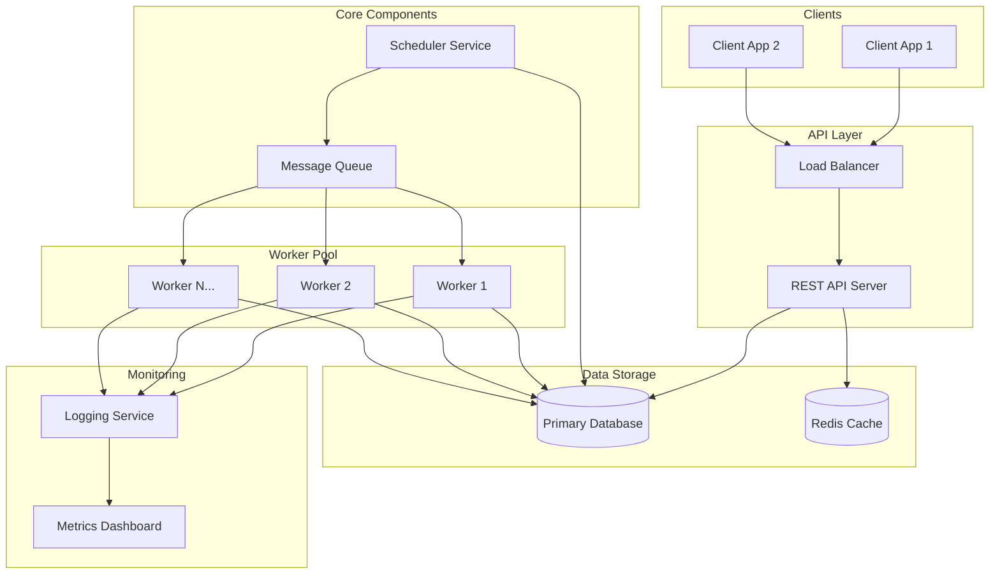
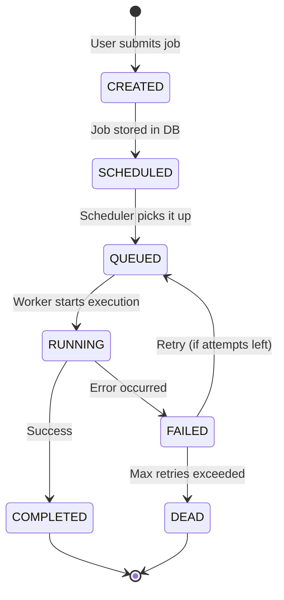
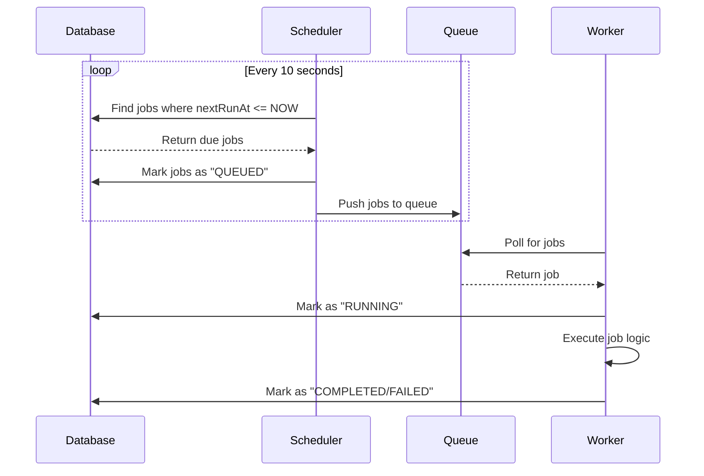
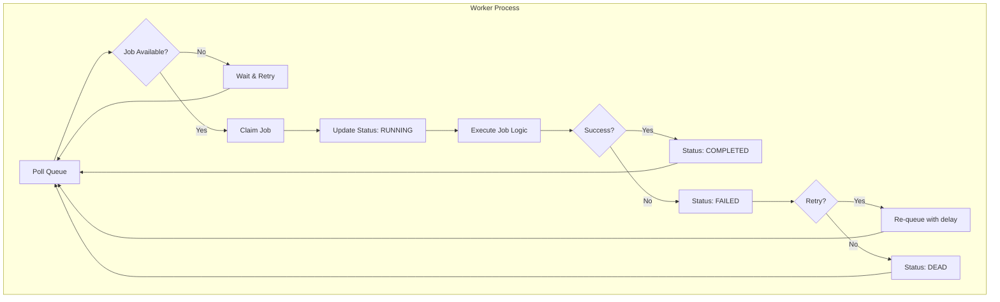
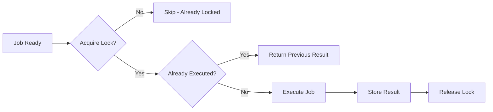
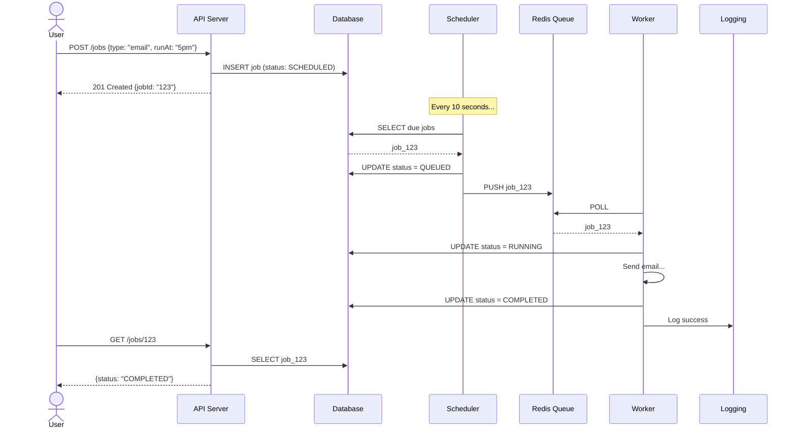

# Job Scheduling System - Architecture Design

A comprehensive guide to building a scalable Job Scheduling System, explained in simple terms suitable for interviews.

---

## 1. High-Level Architecture



### Component Breakdown

| Component | Purpose | Technology Examples |
|-----------|---------|---------------------|
| **API Server** | Accepts job requests, validates input, stores jobs | Node.js/Express, Python/FastAPI |
| **Database** | Stores job definitions, status, history | PostgreSQL, MongoDB |
| **Scheduler** | Scans for due jobs and pushes to queue | Custom service, cron-based |
| **Message Queue** | Holds jobs ready for execution | Redis Queue, RabbitMQ, Bull |
| **Workers** | Actually execute the job logic | Stateless processes |
| **Cache** | Fast access to frequently used data | Redis |
| **Logging** | Records all job activities | ELK Stack, Winston |

---

## 2. Job Lifecycle (From Creation to Completion)



### Lifecycle Explained Simply

1. **CREATED** → User calls API to create a job
2. **SCHEDULED** → Job is saved in database with execution time
3. **QUEUED** → When it's time, scheduler puts job in the queue
4. **RUNNING** → A worker picks it up and starts executing
5. **COMPLETED** → Job finished successfully ✅
6. **FAILED** → Something went wrong ❌
7. **DEAD** → Failed too many times, needs manual intervention

> **Interview Tip:** Think of it like ordering food online - you place order (CREATED), restaurant confirms (SCHEDULED), delivery partner picks up (QUEUED), on the way (RUNNING), delivered (COMPLETED) or cancelled (FAILED).

---

## 3. One-Time vs Recurring Jobs

### One-Time Jobs
```
┌─────────────────────────────────────────┐
│  Execute Once → Done → Never Again      │
└─────────────────────────────────────────┘

Example: "Send welcome email when user signs up"
         "Generate report on Jan 1, 2026 at 9 AM"
```

### Recurring Jobs
```
┌─────────────────────────────────────────────────────┐
│  Execute → Complete → Calculate Next → Schedule     │
│     ↑                                      │        │
│     └──────────────────────────────────────┘        │
└─────────────────────────────────────────────────────┘

Example: "Send daily digest every day at 8 AM"
         "Clean temp files every Sunday at midnight"
```

| Aspect | One-Time Job | Recurring Job |
|--------|--------------|---------------|
| Execution | Once | Multiple times |
| After completion | Marked as done | Next run calculated |
| Schedule field | Single timestamp | Cron expression or interval |
| Database record | Single entry | Parent + instance entries |

### How Recurring Jobs Work Internally

```javascript
// Conceptual representation (not actual code)
Job Schema:
{
  id: "job_123",
  type: "RECURRING",
  schedule: "0 8 * * *",     // Cron: Every day at 8 AM
  nextRunAt: "2026-01-29T08:00:00Z",
  lastRunAt: "2026-01-28T08:00:00Z"
}

// After each execution:
// 1. Mark current instance complete
// 2. Parse cron expression
// 3. Calculate next execution time
// 4. Update nextRunAt in database
```

---

## 4. How Scheduling Works Internally



### The Scheduler's Simple Logic

```
Every 10 seconds (polling interval):
    1. Query: SELECT * FROM jobs WHERE nextRunAt <= NOW AND status = 'SCHEDULED'
    2. For each job found:
       - Lock the job (prevent duplicate pickup)
       - Change status to 'QUEUED'
       - Push to message queue
    3. Sleep for 10 seconds
    4. Repeat
```

> **Why use a queue?** 
> - Decouples scheduling from execution
> - Jobs won't be lost if worker crashes
> - Easy to add more workers for scalability

---

## 5. How Workers Pick and Execute Jobs



### Worker Responsibilities

1. **Polling** → Continuously ask queue "Any jobs for me?"
2. **Claiming** → Lock the job so no other worker takes it
3. **Executing** → Run the actual job code (send email, process data, etc.)
4. **Reporting** → Update database with result (success/failure)
5. **Cleanup** → Release resources and get next job

### Worker Scalability

```
Low Load:    [Worker 1] ← handles all jobs

High Load:   [Worker 1] [Worker 2] [Worker 3] [Worker 4]
                    ↑       ↑           ↑          ↑
                    └───────┴───────────┴──────────┘
                              All poll same queue
```

> **Key Point:** Workers are **stateless** - any worker can execute any job. This allows horizontal scaling (just add more workers).

---

## 6. Retry Mechanism

### Retry Strategy

```
Attempt 1: Execute immediately
   ↓ FAIL
Attempt 2: Wait 1 minute, then retry
   ↓ FAIL  
Attempt 3: Wait 5 minutes, then retry
   ↓ FAIL
Attempt 4: Wait 30 minutes, then retry
   ↓ FAIL
Mark as DEAD → Alert admin
```

### Exponential Backoff Concept

| Attempt | Wait Time | Why? |
|---------|-----------|------|
| 1st retry | 1 min | Maybe temporary glitch |
| 2nd retry | 5 min | Give external service time to recover |
| 3rd retry | 30 min | Serious issue, wait longer |
| 4th retry | 2 hours | Last attempt before giving up |

### Job Schema for Retries

```json
{
  "id": "job_456",
  "maxRetries": 4,
  "currentAttempt": 2,
  "lastError": "Connection timeout",
  "nextRetryAt": "2026-01-28T15:30:00Z",
  "retryHistory": [
    { "attempt": 1, "error": "Connection refused", "at": "..." },
    { "attempt": 2, "error": "Connection timeout", "at": "..." }
  ]
}
```

> **Interview Tip:** Explain that retries help handle **transient failures** (temporary issues) like network timeouts or service being temporarily unavailable.

---

## 7. Avoiding Duplicate Execution

This is **critical** - imagine sending the same email twice or charging a customer twice!

### Problem Scenarios

1. Two schedulers pick the same job simultaneously
2. Worker crashes mid-execution, job gets re-queued
3. Network glitch causes duplicate queue messages

### Solutions

#### A. Database-Level Locking

```sql
-- Atomic update: Only one can succeed
UPDATE jobs 
SET status = 'QUEUED', locked_by = 'scheduler_1', locked_at = NOW()
WHERE id = 'job_123' 
AND status = 'SCHEDULED'
AND locked_by IS NULL;

-- Check: Was my update successful?
-- If rows_affected = 1 → I got the lock
-- If rows_affected = 0 → Someone else got it
```

#### B. Distributed Locks (Redis)

```
Before processing:
  1. Try to acquire lock: SET job:123:lock = "worker_1" NX EX 300
  2. If succeeded → Process the job
  3. If failed → Skip (another worker has it)
  4. After done → Release lock
```

#### C. Idempotency Keys

```
Job: { id: "job_789", idempotencyKey: "email_user_456_welcome" }

Before executing:
  1. Check: Have we completed this idempotencyKey before?
  2. If yes → Return previous result (don't execute again)
  3. If no → Execute and store result with idempotencyKey
```

### Summary of De-duplication Strategy



---

## 8. Complete Data Flow Example

Let's trace a job from creation to completion:



---

## 9. Scalability Design Principles

| Challenge | Solution |
|-----------|----------|
| High API traffic | Multiple API servers behind load balancer |
| Many jobs to schedule | Multiple scheduler instances with leader election |
| Slow job execution | Add more workers (horizontal scaling) |
| Database bottleneck | Read replicas, connection pooling, indexing |
| Queue overflow | Use managed queue service, auto-scaling |

### Architecture for Scale

```
                    ┌─────────────┐
                    │ Load Balancer│
                    └──────┬──────┘
           ┌───────────────┼───────────────┐
           ▼               ▼               ▼
      ┌────────┐      ┌────────┐      ┌────────┐
      │ API 1  │      │ API 2  │      │ API 3  │
      └────────┘      └────────┘      └────────┘
                           │
                    ┌──────▼──────┐
                    │  PostgreSQL  │
                    │  (Primary)   │
                    └──────┬──────┘
                           │
              ┌────────────┼────────────┐
              ▼            ▼            ▼
         ┌────────┐   ┌────────┐   ┌────────┐
         │Replica1│   │Replica2│   │Replica3│
         └────────┘   └────────┘   └────────┘
```

---

## 10. Summary for Interview

> **"A Job Scheduling System consists of an API layer that accepts job requests, a database that stores job definitions and state, a scheduler that polls for due jobs and pushes them to a message queue, and stateless workers that execute jobs from the queue. One-time jobs run once and are marked complete, while recurring jobs calculate their next execution time after each run. We avoid duplicate execution using database locks and idempotency keys. Failed jobs are retried with exponential backoff. The system scales horizontally by adding more API servers and workers."**

---

## Quick Reference

### Key Concepts Checklist

- [ ] **API Server**: REST endpoints for CRUD operations on jobs
- [ ] **Database**: Persistent storage for job state and history
- [ ] **Scheduler**: Polls DB and pushes due jobs to queue
- [ ] **Message Queue**: Decouples scheduling from execution
- [ ] **Workers**: Stateless processes that execute jobs
- [ ] **Retry Logic**: Exponential backoff for failed jobs
- [ ] **Deduplication**: Locks + idempotency keys
- [ ] **Logging**: Track all job executions and failures

### Common Interview Questions

1. **How do you ensure a job runs exactly once?** → Database locks + idempotency keys
2. **How do you handle worker failures?** → Job remains in queue, another worker picks it up
3. **How do you scale the system?** → Add more workers (horizontal scaling)
4. **Difference between one-time and recurring jobs?** → One-time runs once; recurring calculates next run
5. **Why use a message queue?** → Decoupling, reliability, scalability
